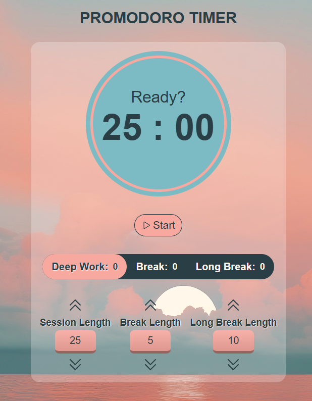

# ⏰ Pomodoro Timer

> A minimalist and distraction-free Pomodoro timer, ideal for productivity, deep work, and study sessions.

## 📌 Project Description

> Minimalist Pomodoro Timer is a distraction-free, web-based timer designed to help you stay focused and productive during deep work and study sessions. Inspired by the Pomodoro Technique, this lightweight application allows you to alternate between work intervals and short or long breaks with ease. Its clean, simple interface eliminates distractions, making it ideal for students, remote workers, developers, or anyone seeking to improve their time management.

## 🚀 Features

- Feature 1: ⏱️ Adjustable session, break, and long break durations
- Feature 2: 🔔 Alarm notifications at the end of each interval
- Feature 3: 🧘 Clean and minimal UI focused on productivity
- Feature 4: 🎯 Ideal for deep work, study sessions, and focused tasks
- Feature 5: 🔄 Easy to reset or switch between work modes

## 🛠️ Built With

- HTML
- CSS
- JavaScript

## Credits

- Audio: Pixabay by 3Dabrar
- Background Image: FREEP!K
- Favicon: icon by Icons8